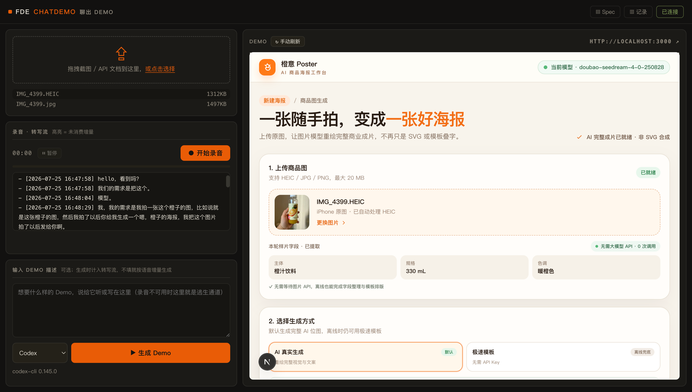
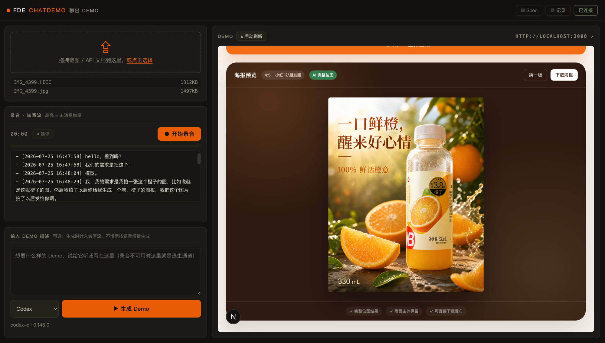

# FDE ChatDemo — 聊出 Demo

**The demo builds while you talk.** 坐在客户对面，边聊需求，Demo 边成形——
这场会聊完，客户手里已经有一个能点的 Demo 和一页可确认的需求清单。



> 真实使用画面，无摆拍：左侧转写流里是用户对着麦克风说的原话——「我拍一张
> 这个橙子的图……你给我生成一个橙子的海报」；右侧就是**聊出来的 Demo**：
> 一个完整的 AI 商品海报工作台，连他手里那瓶橙汁的照片都被识别摄取了
> （主体：橙汁饮料 · 330mL · 暖橙色）。全程没有写一行代码。



> 同一场对话的下一幕：**成品出来了**。那瓶随手拍的橙汁被重绘成商业成片——
> 「一口鲜橙，醒来好心情 · 100% 鲜活橙意」，4:5 小红书/朋友圈规格，商品
> 主体保留，可直接下载发布。从开口说话到这张海报，隔着的只有几个回合。

## 它怎么工作

```
 说话 / 拖材料 ──→ 云端转写落账 ──→ [▶ 生成 Demo] ──→ 回合协议 ──→ 右侧预览刷新
   （录音）        （TRANSCRIPT.md）    （你控制节拍）    （引擎执行）     （客户看这里）
```

核心是**回合制**：agent 不在客户说话时抢跑，你在对话的自然停顿处点一下
「生成 Demo」。每个回合固定五步、预算 3 分钟：

1. **摄取**——读转写增量 + 新材料（截图 / API 文档，iPhone HEIC 自动转码）；
2. **查阶梯**——复用（预验证开源画廊）> 组装（模板模块）> 生成（最后手段）；
3. **先改 spec 再改代码**——`DEMO_SPEC.md` 是单一事实源，转写永不直接驱动代码；
4. **最小变更 + 截图自检**——投到幕布上的界面永远不能是坏的；
5. **一行总结**——FDE 能直接念给客户听的一句话。

超预算就占位并记入「暂缓项」——宁可占位，不可让客户等。每回合的
输入 → 输出自动落账到 `SESSION.md`，面板、终端、文件三处同步可查。

## 快速开始

```bash
# 一次性准备
git clone https://github.com/OpenFDEAI/ChatDemo.git && cd ChatDemo && npm link

# 之后每次拜访客户：新建一个文件夹，终端里敲
fde-demo
```

一条命令自动完成：建工作区骨架 → 拷模板装依赖（仅首次）→ 起 Demo dev
server → 起面板 → 自动选可用引擎 → 打开浏览器。然后就是现场三件事：
**拖材料、开口说话、点 ▶ 生成 Demo**。Ctrl-C 一键全退。

面板要点：右上 **▤ Spec / ▥ 记录** 开关按需弹出需求台账与回合账本
（VS Code 式）；Demo URL 点 ↗ 新窗口打开完整页面投屏给客户。

<details>
<summary>其他使用方式（Skill / Plugin / Codex TUI / 面板单独起）</summary>

**作为 Claude Code Skill**

```bash
cp -r ChatDemo/skills/fde-demo ~/.claude/skills/   # 或项目内 .claude/skills/
# Claude Code 里：给它客户截图 + API 文档，说"为 <客户> 开一场 demo session"
```

**作为 Plugin**

```
/plugin marketplace add OpenFDEAI/ChatDemo
/plugin install fde-demo
```

**在 Codex TUI 中**：`cd ChatDemo && codex`，AGENTS.md 会引导加载工作流；
截图用 `codex -i 截图.png` 附带。

**面板单独起**：`cd console && npm install && npm start -- --workspace <目录>`，
参数见 [console/README.md](console/README.md)。

</details>

## 双引擎 · 三种转写

- **引擎**：Claude Code 与 Codex 双引擎，面板下拉**运行时切换**——回合无状态、
  状态全在工作区文件，切换不丢上下文，一场会议中途换引擎也行（两条链路均已
  真机端到端验证）；
- **转写**：**火山引擎云端**（默认推荐，中文质量最好，凭证面板粘贴或环境变量）/
  浏览器识别（零安装测试用）/ FunASR 本地（数据敏感客户，不上云）。
  录音须会前告知客户；转写全程只落文字，音频不存盘。

## 仓库里有什么

| 目录 | 内容 |
|---|---|
| `skills/fde-demo/` | Skill 本体：工作流状态机 + 提问清单 + **10 个行业场景剧本** + 品牌化模板底座（theme.json 一个文件换肤）+ OpenAPI→mock 摄取 + 预验证开源画廊 |
| `console/` | 面板：录音 / 拖材料 / 一键回合 / 回合落账 / 双引擎切换（31 项自动化测试） |
| [REHEARSAL.md](REHEARSAL.md) | 20 分钟模拟客户会议全程实录——6 个回合、一次客户否决、一次超预算、四个当场抓出的问题，全部如实记录 |
| [DESIGN.md](DESIGN.md) | 完整设计方案：形态决策、开源优先管线、双引擎架构、调研附录 |
| [TESTING.md](TESTING.md) | 自动化回归 + 模拟客户会议验收手册 |
| `examples/hongda-rehearsal/` | 演练全部产物：spec 终版、演示台词、判断记录、可复跑的 app |

## 现状与路线（诚实版）

- ✅ 一条命令启动器；双引擎真机验证；火山云端转写真机验证；面板全流程
  （材料 / 录音 / 描述 / 回合账本 / Spec 开关）；回归全绿（面板 31 项、
  ingest 4 项、模板 build）；20 分钟模拟会议验收通过；
- 🕓 待实测：FunASR 本地链路、画廊 refine/tremor/open-lovable 条目跑通；
- 🔜 v0.3：画廊机制化（社区共建的预验证 Demo 池）、`decisions.jsonl` →
  [OpenFDE](https://github.com/Open-FDE/OpenFDE) FDE Loop（Judgment Unit
  采集入口）、说话人分离（双通道领夹麦）、npm 发布。

## License

MIT © OpenFDE
