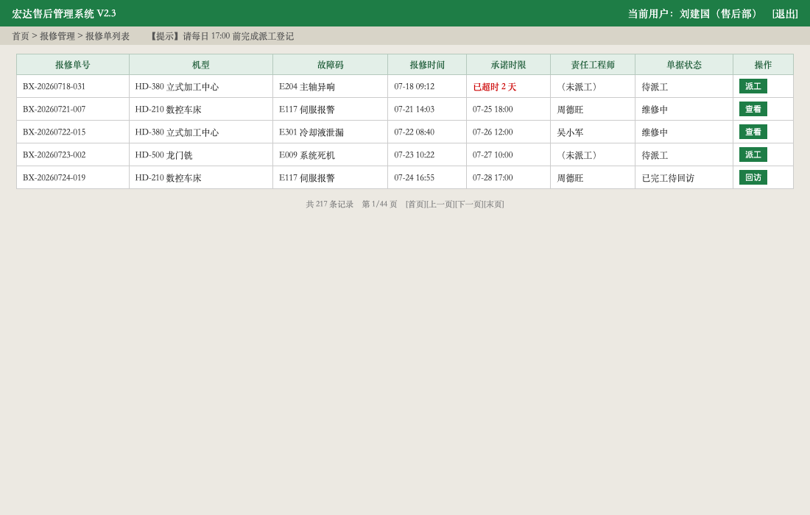
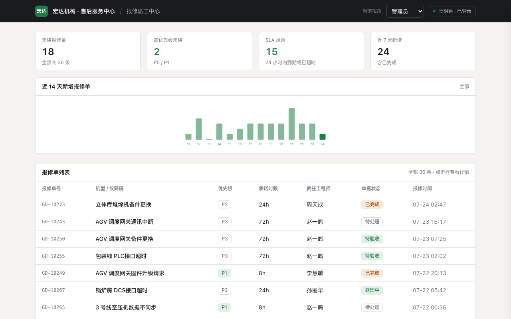
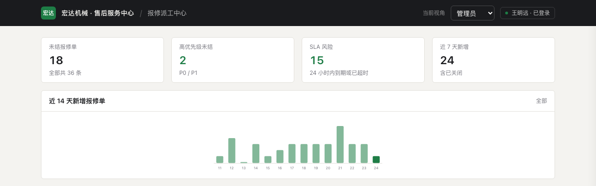
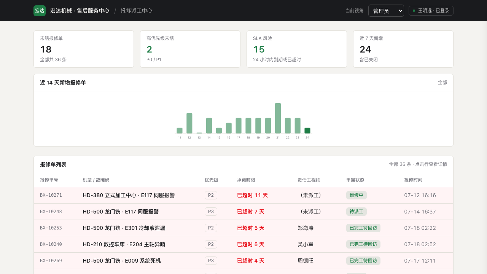
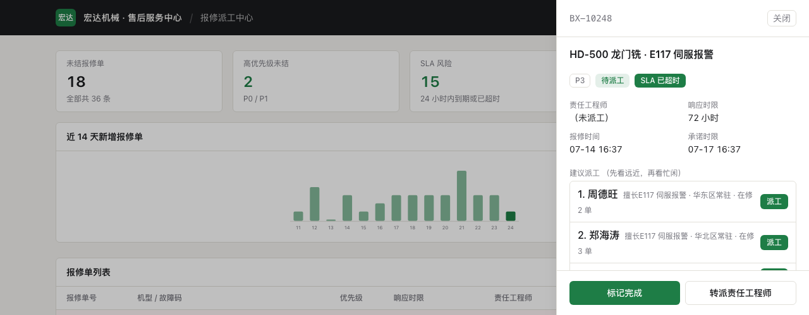
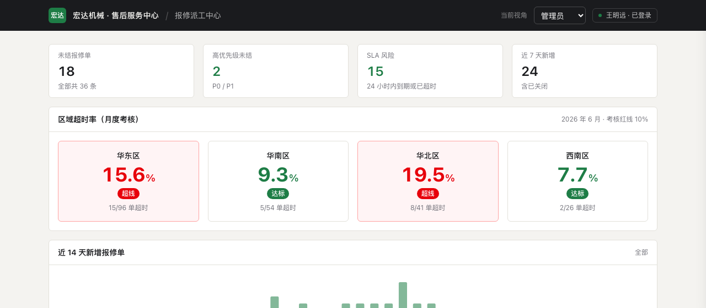
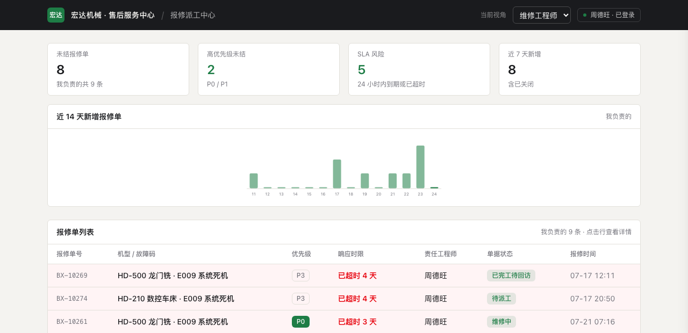

# 模拟客户会议实录：20 分钟，6 个回合，边聊边出 Demo

> 2026-07-25，按 [TESTING.md](TESTING.md) §2 对 fde-demo skill v0.1 做的首次
> 全流程验收演练。**真实模型、真实回合、真实翻车与修复**——包括一次超预算
> 和四个当场抓出的问题，全部如实记录。剧本用
> [skills/fde-demo/references/scenarios.md](skills/fde-demo/references/scenarios.md) 的剧本 1（制造业售后工单）。

## 设定

- **虚构客户**：宏达机械，设备厂商，售后派工靠一套老系统 + Excel + 微信群；
- **输入材料**（`examples/hongda-rehearsal/inputs/`）：3 张旧系统截图 + 1 份 OpenAPI
  对接文档（报修单/工程师两个资源）；
- **运行方式**：Claude Code TUI 回合制——FDE 在对话停顿处敲一句要点，
  skill 执行「摄取 → 改 spec → 最小变更 → 截图自检 → 一行总结」五步；
- **验收标准**：会前 ≤10 分钟出品牌化底座；每回合 ≤3 分钟；全程 spec 先行；
  至少一次客户否决入档；收尾四件产物齐全。

客户的「旧系统」（演练用 HTML 渲染生成，字段与痛点即剧本设定）：

注意三个后面会用到的细节：深绿品牌色、术语叫**报修单/派工/承诺时限**
（不是工单/派单/SLA）、第一行就有一张「已超时 2 天」还没派工的单。

## 时间线

| 阶段 | 时间 | 用时 | 预算 | 判定 |
|------|------|------|------|------|
| start 品牌化底座 | 09:57:07 – 10:00:35 | 3.5 分钟 | ≤10 分钟 | ✅ |
| R1 字段替换 | – 10:03:08 | 2.5 分钟 | ≤3 分钟 | ✅（含修 1 个模板 bug） |
| R2 超时置顶 | – 10:05:21 | 1.5 分钟 | ≤3 分钟 | ✅ |
| R3 建议派工 | – 10:10:25 | **4.5 分钟** | ≤3 分钟 | ❌ 超 1.5 分钟（见「问题 4」） |
| R4 区域考核 | – 10:12:33 | 1.5 分钟 | ≤3 分钟 | ✅ |
| R5 客户否决改版 | – 10:14:11 | 1 分钟 | ≤3 分钟 | ✅ |
| R6 一线视角 | – 10:16:09 | 1 分钟 | ≤3 分钟 | ✅ |
| wrap 四件产物 | – 10:17 | 1 分钟 | ≤5 分钟 | ✅ |

## start：3.5 分钟出品牌化底座

从截图**多模态摄取**品牌色（`#1e7d46`）与术语表，写进模板的 `theme.json`
（一个文件完成换肤换术语）；`ingest-api.ts` 把 OpenAPI 转成同构 mock 数据
与类型化 client；起 dev server，截图自检：

此时表头术语已经是客户的叫法，但数据还是模板默认内容——字段替换留给 R1，
这正是「组装快于生成」：开场先有可看的东西，再逐回合逼近。

## 六个回合

**R1**（FDE：「客户说数据不对，我们的单子是 BX 开头的报修单，看机型和故障码」）
换数据域：BX 单号、机型 · 故障码、截图里的工程师实名。截图自检当场抓出
**模板 bug**：未结统计硬编码「已完成」，换域后 36/36 全算未结——回合内修复。

> 一行总结：「列表已换成贵方的报修单——BX 单号、机型加故障码，责任工程师
> 就是截图里那几位。」

**R2**（「紧急单老压在群里没人看，超时的要一眼看见、顶在最上面」）
超时单红底置顶、按超时时长倒排，「承诺时限」列直接显示**超了多久/还剩多久**：

**R3**（「客户眼睛亮了，问能不能自动派工；追问出口诀——先看远近再看忙闲」）
「待派工」的单打开详情即有前 3 位人选，**推荐理由就是客户的口诀**：擅长该
故障码 → 常驻区域 → 在修几单。客户自己的判断出现在系统里——这是
Judgment Unit 的现场预演，也是本场的第二打动点。

**R4**（「老板要按区域看超时率，考核红线 10%，超线点名」）
按 6 月报表截图做区域考核卡：华东 15.6%、华北 19.5% 超线标红。

**R5 · 客户否决**（「横条图老板不看——要车间看板那种大数字，红绿分清」）
否决与理由入档（spec「已否决」+ `decisions.jsonl` rejection 行），1 分钟改版：

**R6**（「一线工程师别看考核，只看自己名下的单」）
角色切到「维修工程师·周德旺」：只看名下 9 条单，考核看板隐藏：

## wrap：可带走的四件产物

`DEMO_SPEC.md` 终版（页面全 done、**暂缓项逐条明示哪些是演示假数据**——
Demo 不能被当成交付承诺）、`WALKTHROUGH.md` 六步演示台词、
`decisions.jsonl` 4 条判断记录（oss_pick / customer_signal / fde_call /
rejection，会后喂给 FDE Loop 的 INDUCE）、画廊回填
（[skills/fde-demo/gallery/templates-base.md](skills/fde-demo/gallery/templates-base.md) 标 ✅ 并记了坑）。

## 演练抓出的 4 个真问题（全部闭环）

1. **模板关单状态硬编码**——换数据域后未结统计失真。修复并回灌
   `templates/base`（closed 状态改从 DomainConfig 推导），重建通过；
2. **术语表键值冲突**——`theme.json` 里 sla/dueAt 都映射「承诺时限」，导致
   详情页字段重名 + React 重复 key 告警。修复，教训写入
   [skills/fde-demo/references/demo-kit.md](skills/fde-demo/references/demo-kit.md)：术语表键值必须唯一；
3. **缺演示深链**——补了 `?open=<单号>` 直开详情、`?role=agent` 直切视角，
   投屏跳转与截图自检都依赖它，已回灌模板；
4. **R3 为什么超时**——回合内顺手做了工具性改进（加深链）。规则已写回
   [skills/fde-demo/SKILL.md](skills/fde-demo/SKILL.md)：**自检只修投屏可见的问题，工具性改进进暂缓项**，
   否则 3 分钟回合就会变成 4.5 分钟。

## 结论与边界

- 验收整体通过：回合制节拍在真实模型上跑得动，3 分钟预算可守（唯一超时
  的回合原因明确且已立规矩）；spec-first 与截图自检两条铁律在实战里各拦下
  一次事故；
- 本场跑的是 **Claude Code TUI 模式**（v0.1 主路径）。现场控制台
  （`console/`，录音 → 转写 → 一键回合 → 自动刷新）的 mock 链路有 15 个
  单测覆盖，但 `--adapter claude` 真机链路与 FunASR 语音链路在本场未实测；
- 复现方法见 [TESTING.md](TESTING.md) §2，演练工作区在仓库
  `examples/hongda-rehearsal/`（含全部中间产物，可直接 `npm install && npm run dev`
  复跑）。
